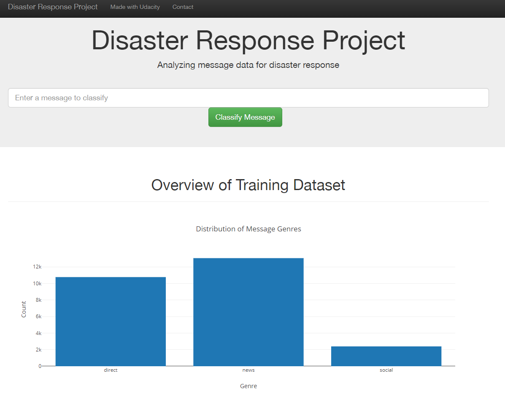
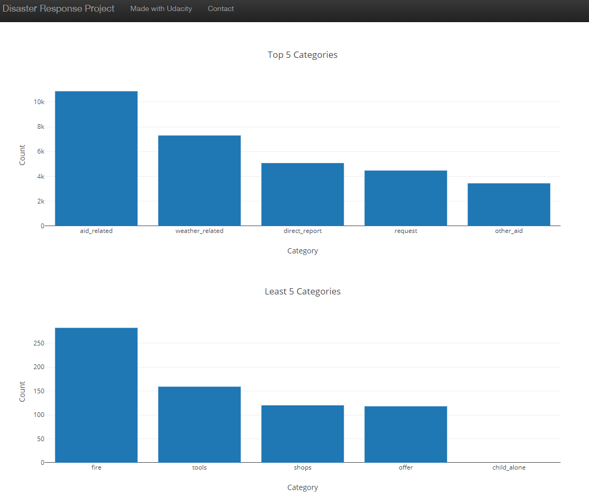
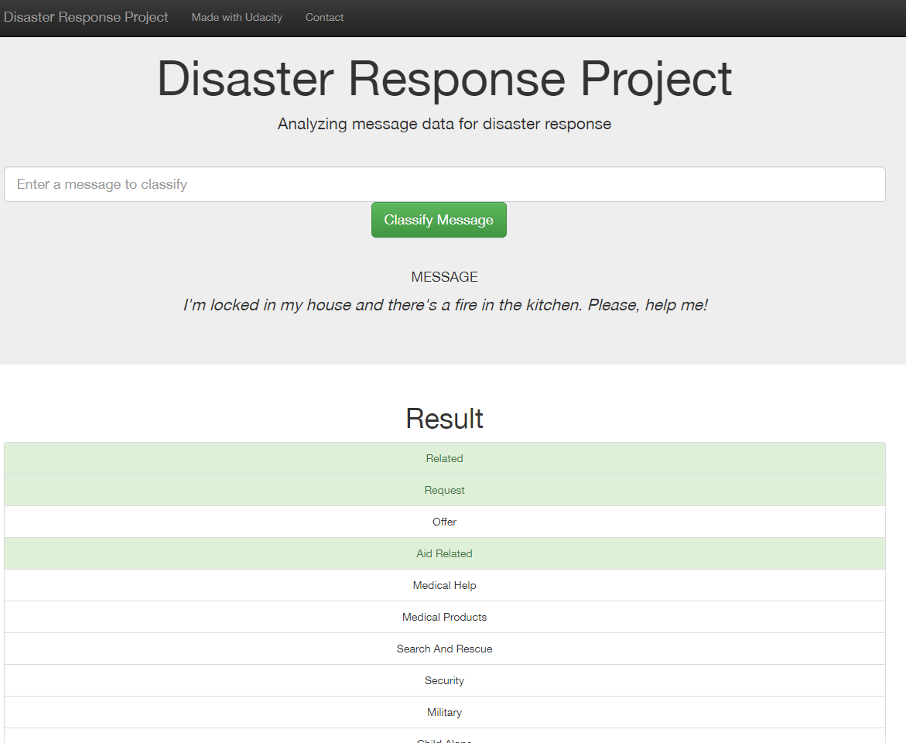

# Disaster Response Pipeline Project

# Table of Contents
1. [Installation](#installation)
2. [Instructions](#instructions)
3. [Project Overview](#motivation)
4. [File Descriptions](#files)
5. [Results](#results)
6. [Licensing, Authors, and Acknowledgements](#licensing)

<a name="installation"></a>
## Installation

You can clone this repository with the command below:

```
git clone https://github.com/federicomartini/disaster_response_pipeline
```

In order to use the code contained in this repository you need to install the following libraries in your environment:
* Json
* Plotly
* Pandas
* sklearn
* sqlalchemy
* numpy
* flask
* pickle
* re
* ntlk

Moreover, you need to run code written in **Python 3** and **HTML**.

<a name="instructions"></a>
## Instructions

The repository contains **Python scripts**. Below are the instructions to run the scripts:

   * **data/process_data.py**
        This script Extract, Transform and Load (ETL) data about **messages** and **categories** into the **Database**. To execute
        it you should go into the **data/** folder and run the command below (replace the paths placeholders with the files 
        path on your enviroment):
        `python process_data.py path-to-messages-csv-file path-to-categories-csv-file path-to-disaster-db`
   * **models/train_classifier.py**
        This script creates the Pipeline, train and test the model. To execute it you should go into the **models/** folder and
        run the command below:
        `python train_classifier.py path-to-disaster-db models/multioutclassifier.pickle`
   * **app/run.py**
        This script runs a **Web Page** that takes advantage of the **model** you created with the above scripts. To execute it
        you should run the command below:
        `python run.py`
   * **Web Page**
        The web page is accessible at the address http://0.0.0.0:3000/. 

<a name="motivation"></a>
## Project Overview
The goal of this project is to create a Web Page that takes advantage of a classification model to classify messages about
disasters to redirect this messages to the right departments. The model is trained using Machine Learning algorithm and Pipeline
techniques to find the optimal model thanks to the **Cross Validation** features provided with the **GridSearchCV** object.

<a name="files"></a>
## File Descriptions
   * **data/process_data.py**
        Python script to Extract, Transform and Load (ETL) data about **messages** and **categories** into the **Database**.
   * **data/ETL Pipeline Preparation.ipynb**
        Jupyter Notebook that contains all the steps for the ETL Process
   * **data/disaster_messages.csv, data/disaster_categories.csv**
        Raw data about messages and categories
   * **data/DisasterResponse.db**
        Database created by the **process_data.py** script (ETL process output).
   * **models/train_classifier.py**
        Script to create the Pipeline, train and test the model.
   * **models/ML Pipeline Preparation.ipynb**
        Jupyter Notebook that contains all the steps to train and test the model, and create a pickle file for the model.
   * **models/multioutclassifier.pickle**
        Pickle file containing the optimal model calculated with the **train_classifier.py**
   * **app/run.py**
        Script that runs a **Web Page** that takes advantage of the **model** you created with the above scripts.

<a name="screenshots"></a>
## Screenshots





<a name="licensing"></a>
## Licensing
This repository is an extension of the starter code provided by [Udacity](https://www.udacity.com) as part of the **Data Scientist Nanodegree**. The data was provided by [Figure Eight](https://www.figure-eight.com)
